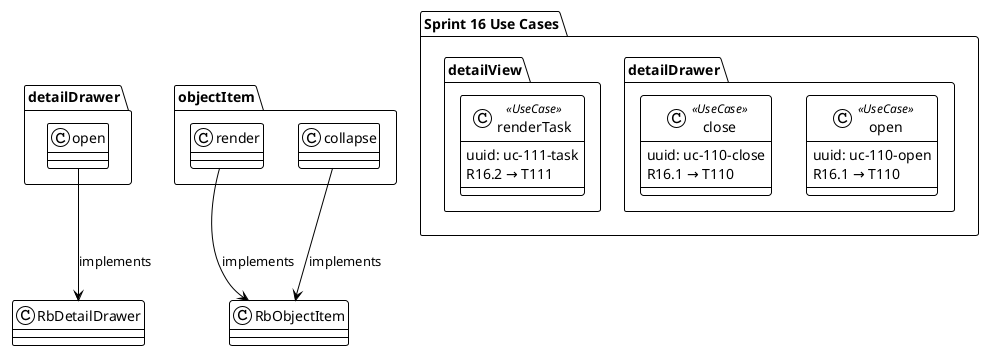

[Back to Sprint 16 Planning](./planning.md)

# T117: UseCase as class instances in PUML

[task:uuid:11179033-e47b-4f68-c915-8a7fd3046c27]

## Status
- [ ] Planned
- [ ] In Progress
  - [x] refinement (architect)
  - [ ] creating test cases
  - [ ] implementing
  - [ ] testing
- [ ] QA Review
- [ ] Done

> QA Review + Done are TRON's gate only — never checked by planner/sync.

## Traceability

`[task:uuid:11179033-e47b-4f68-c915-8a7fd3046c27]`

- up
  - [Sprint 16 Planning](./planning.md)
  - [compound-requirement-source.md](./compound-requirement-source.md) → **R16.10** (UseCase as class instances in PUML)
  - [traceability-standard.md](../../standards/traceability-standard.md)
- down
  - None (atomic task)
- chain (req → usecase → puml → class/method)
  - **requirement:** R16.10
  - **use case:** useCase.trackInPuml [uc:uuid:16a01171-d171-4a01-b171-000000117001]
  - **puml:** [diagrams/s16-usecases.puml](./diagrams/s16-usecases.puml) (Phase 3 package) — AUTHORED
  - **class/method:** `TraceConsistency.ts` → `parseStereotype()` (<<UseCase>> PUML parsing)
  - Establishes the **use case** link as a first-class node so T116's chain is complete

## Task Description
Track use cases in **PUML as dedicated instances of a `UseCase` class** (first-class
objects, not just labels/notes). This makes each use case an addressable node that
methods and requirements link to, enabling T116's method→UC→requirement chain.

## Context
Tron 2026-05-27: "this implies tracking the usecases in puml as dedicated instances of
a UseCase class."

## Acceptance Criteria
- [ ] AC1 — A `UseCase` class is defined in PUML; each use case is an instance of it
- [ ] AC2 — Use case instances carry an id linking up to a requirement and down to classes/methods
- [ ] AC3 — Existing use-case references migrate to the first-class instance form (no orphan labels)
- [ ] AC4 — Generated SVG renders; /trace can surface UseCase nodes
- [ ] `npm run build` succeeds; no regression

## Architect Design — robbin-architect

### PUML pattern: UseCase as stereotyped class

Instead of UML use case ovals (which can't carry structured data), model use cases as class instances with a `<<UseCase>>` stereotype:

```plantuml
class "detailDrawer.open" <<UseCase>> {
  uuid: uc-110-open
  requirement: R16.1
  task: T110
  object: DetailDrawer
  verb: open
}

class "objectItem.render" <<UseCase>> {
  uuid: uc-112-render
  requirement: R16.3 + R16.4
  task: T112
  object: ObjectItem
  verb: render
}
```

### Object.verb naming convention

Every use case is named `Object.verb` (matching T104 S15 pattern):
- `detailDrawer.open` — T110
- `detailDrawer.close` — T110
- `detailView.renderTask` — T111
- `detailView.renderRequirement` — T111
- `objectItem.render` — T112
- `objectItem.generateName` — T112
- `objectItem.setIcon` — T113
- `objectItem.drag` — T114
- `objectItem.collapse` — T115
- `objectItem.expand` — T115
- `treeItem.expandChildren` — T115
- `traceChain.auditOrphans` — T116
- `useCase.trackInPuml` — T117

### PUML file — AUTHORED (robbin-architect 2026-05-27)

**File:** `scrum.pmo/sprints/sprint-16-traceability-ux/diagrams/s16-usecases.puml` — **CREATED + RENDERED**
**SVG:** 95KB, renders clean, zero errors.

15 UseCase instances across 3 phases, each with `[uc:uuid]`, requirement link, task link, implementing class link.

Full PUML at `diagrams/s16-usecases.puml`. Supersedes the placeholder below:

Previous placeholder create instruction (now DONE):



### TraceModel integration

The `trace-cli.ts` already parses PUML class diagrams into TraceModel objects. UseCase classes with `<<UseCase>>` stereotype will be parsed as `type: 'usecase'` objects. Their fields (requirement, task) become links in the TraceModel graph.

### Expert work

1. Create `s16-usecases.puml` with all S16 use cases as `<<UseCase>>` classes
2. Ensure `trace-cli.ts` recognizes `<<UseCase>>` stereotype and maps to `type: 'usecase'`
3. Link each UC to its implementing class via `-->` arrows in PUML
4. Render SVG

## Dependencies
- **Requires:** None (architect-led modeling task)
- **Enables:** T116 (chain review uses first-class UseCase instances)

## Definition of Done
- [ ] All AC met; chain links resolve
- [ ] Tests pass, build clean
- [ ] Tron QA approved

## QA Audit & User Feedback
- 2026-05-27: Planned from compound source R16.10. Awaiting architect design, then Tron QA.

## Subtasks
None (atomic task).

---

*Sprint 16 — Traceability UX & DetailViews*
*Owner: robbin-architect (design), robbin-expert (implement), robbin-tester (verify)*
*Priority: 7 (Phase 3 — enables chain review)*
