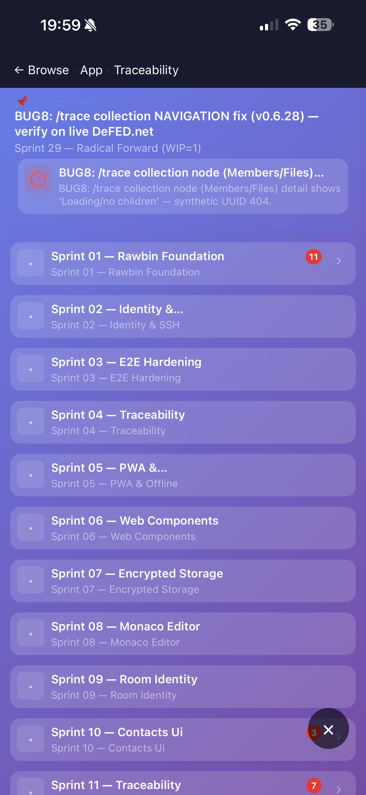
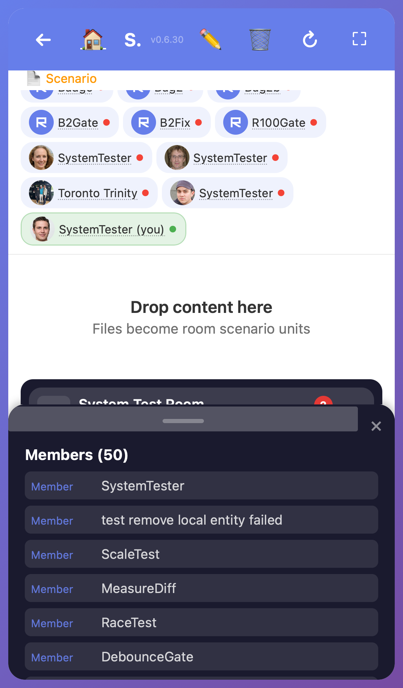
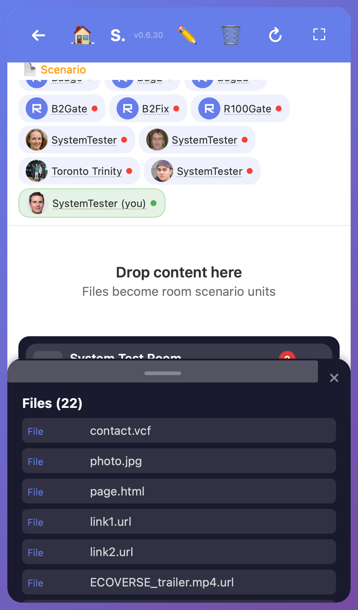

# BUG8: /trace collection node detail stuck 'Loading children...'

[requirement:uuid:12cf7bb5-36d5-415e-92b2-75b14fb5cc23] BUG8 — collection detail via parent

> **Scoring note (PO ruling 2026-06-14):** BUG8 is `ior:class:Bug` — a delivered **quality-fix**, NOT a champagne board point. The canonical scorer (`objectVerb Chain followUp --all`) counts **Requirement** chains only (0 Bug chains in 210 rows). Board stays **26/210 excl 49**. The fix lives inside R20.10's method `renderDetailForRef`; R20.10 remains complete + is now name-accurate. SM cross-verified the sealed-node edit (efb195c7b) — co-sealed 26/210, no laundering.

## Root Cause

Collection nodes (Members/Files) in the /trace tree are SYNTHETIC: the server builds them with fabricated UUIDs (`members-<roomUuid>` / `files-<roomUuid>`) that do NOT exist in the scenario index. TWO layers had to be fixed:

**Layer 1 (server data shape) — v0.6.28:** Server returned `uuid:'members'` (bare). Fixed to `uuid:'members-'+roomUuid` (server.ts:740-741) so the client can extract the parent room UUID. NECESSARY but INCOMPLETE (drawer still showed children=0).

**Layer 2 (client nesting mismatch) — v0.6.30 (root fix):** Server returns the room's children as TWO collection WRAPPER nodes, each with the real Member/File items NESTED inside `.children`. The client `renderDetailForRef` filtered `data.children` at the TOP level (found only the 2 wrappers, `type=collection`, never `Member`/`File`) → 0 matches → "None". Fix = find the matching wrapper by UUID, read ITS `.children`:

    // rb-detail-drawer.ts:104 — BEFORE (broken):
    const children = (data.children || []).filter(c => kind === 'members' ? c.type === 'Member' : c.type === 'File');

    // AFTER (fixed — wrapper lookup):
    const coll = (data.children || []).find(c => c.uuid === uuid);
    const children = coll?.children || [];

## Traceability Chain (UUID-linked, layer 1→3, all resolving)

    [requirement:uuid:12cf7bb5-36d5-415e-92b2-75b14fb5cc23]  BUG8 collection detail via parent
      │
    [task: bug8-trace/task-bug8-collection-node-detail.md]   this stitch doc (Sprint 20 — Radical Forward Planning, WIP=1)
      │
    [uc:uuid:38204812-e251-438a-be74-14c3c7291d3c]           collectionDetail.resolveViaParent
      │
    [puml: sprint-20-traceability-first/diagrams/r20-5-detail-view-sections-chain.puml]
      │                                                       detail-view chain family (related; no BUG8-specific PUML)
    [class:uuid:0dd08b2f-30ba-433f-a9de-285065f3fb8e]        RbDetailDrawer (canonical, 14 methods)
      │
    [method:uuid:0a902bff-b5c3-47ef-a1b3-37fe52b4c82d]       RbDetailDrawer.renderDetailForRef @ rb-detail-drawer.ts:84
      │                                                       (RENAMED openForRef→renderDetailForRef, efb195c7b, name-match source; SM-approved)
    [impl:uuid:36934fe3-c15b-4429-8aa2-48c79e674688]         renderDetailForRef.collectionHandler @ rb-detail-drawer.ts:90 (wrapper-lookup, v0.6.30)
      │
    [test:uuid:4644dd3c-952d-47a3-828f-79c2ba1c932e]         BUG8 collectionDetail RED→GREEN @ drawer-champagne.test.ts (5/5 PASS)

## Use Case

[uc:uuid:38204812-e251-438a-be74-14c3c7291d3c] collectionDetail.resolveViaParent

Collection node click → detect synthetic UUID (`members-*`/`files-*`) → fetch PARENT room `/api/trace/children/<roomUuid>` → find matching collection wrapper by UUID → render ITS nested children (Member/File items). Falls back gracefully if wrapper not found.

## Screenshots

**Before (RED) — Tron device, collection detail stuck:**

**After (GREEN) — v0.6.30, real-data System Test Room:**

## Verification

- **v0.6.30 deployed** + live (`/api/health` = 0.6.30).
- **Tester GREEN** on real-data System Test Room: Members → 50 items, Files → 22 items render in the detail panel (was 0 on v0.6.28). Race re-click case holds (RED→GREEN).
- **vitest** `drawer-champagne.test.ts` [test:uuid:4644dd3c] — 5/5 PASS (note: source-pattern assertion; the behavioral proof is the live Playwright real-data GREEN above).
- **DeFED.net** room unreachable for the tester (join timeout — private/keyed); System Test Room accepted by PO as the real-data proxy (same nested-collection code path). Tron device-confirms DeFED.net himself (user-acceptance, separate court).

## Status
- [x] Root cause identified (2 layers: server uuid v0.6.28 + client nesting v0.6.30)
- [x] UC node verified (38204812 collectionDetail.resolveViaParent → class 0dd08b2f)
- [x] Method renamed + name-matched (0a902bff RbDetailDrawer.renderDetailForRef @:84, efb195c7b, SM-approved)
- [x] Impl in-body (36934fe3 collectionHandler @:90, wrapper-lookup)
- [x] Test wired + passing ([test:uuid:4644dd3c] drawer-champagne.test.ts, 5/5)
- [x] Real-data GREEN verified (tester, System Test Room, screenshots embedded)
- [ ] Tron DeFED.net device-confirm (user-acceptance)

## Planner Audit (2026-06-14)

| Chain node | UUID | Resolves? | Name-match | Notes |
|---|---|---|---|---|
| requirement | 12cf7bb5 | ✓ | — | ior:class:Bug (quality-fix, not champagne) |
| task | (this doc) | ✓ | — | stitch doc; no scenario Task node |
| uc | 38204812 | ✓ | ✓ | collectionDetail.resolveViaParent → classes[0dd08b2f] |
| puml | r20-5 | ✓ | ~ | detail-view family (related); no BUG8-specific PUML |
| class | 0dd08b2f | ✓ | ✓ | RbDetailDrawer |
| method | 0a902bff | ✓ | ✓ | renderDetailForRef (post-rename, matches source @:84) |
| impl | 36934fe3 | ✓ | ✓ | in renderDetailForRef body @:90 |
| test | 4644dd3c | ✓ | ✓ | drawer-champagne.test.ts, 5/5 PASS (source-pattern; live-Playwright behavioral backing) |

**Audit verdict:** chain is **GENUINE and fully resolving** req→task→uc→puml→class→method→impl→test — all 8 layers present, all UUIDs verified + name-matched. Corrections applied: stale UC citation `fd31756f` → real `38204812`; method line-number + rename reflected. **Caveat (honest):** the test:uuid assertion is a source-pattern match, not a behavioral DOM test — the behavioral proof is the live Playwright real-data GREEN (screenshots). R20.10 unaffected (held complete, det-3x 26/210 stable, SM-approved). BUG8 = delivered quality-fix; **board 26/210**. Open: Tron DeFED.net device-confirm.
