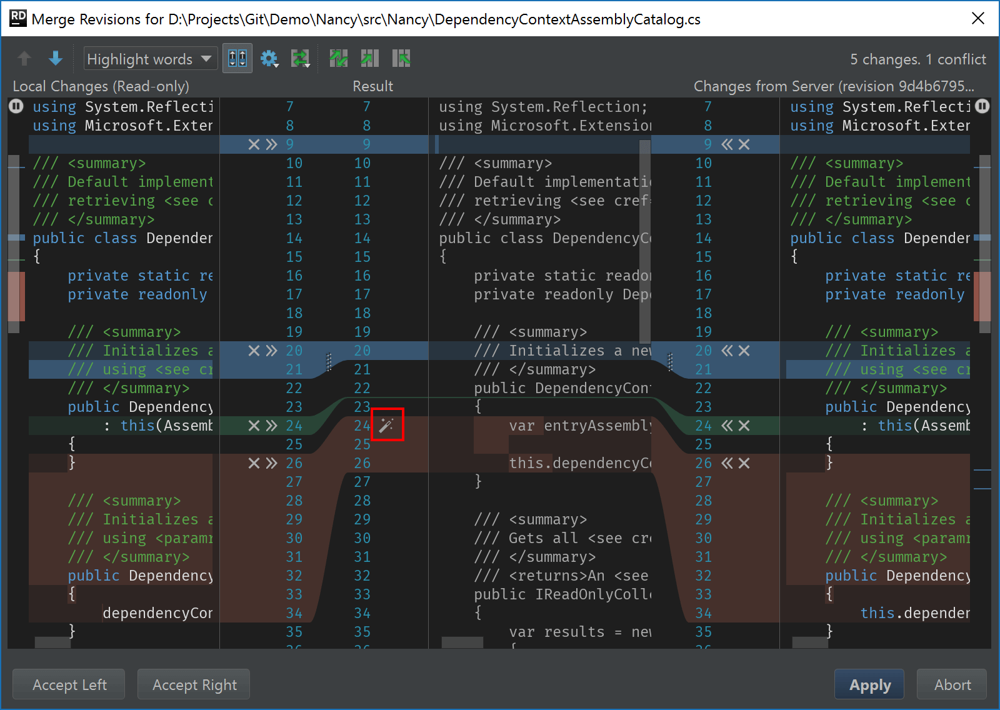
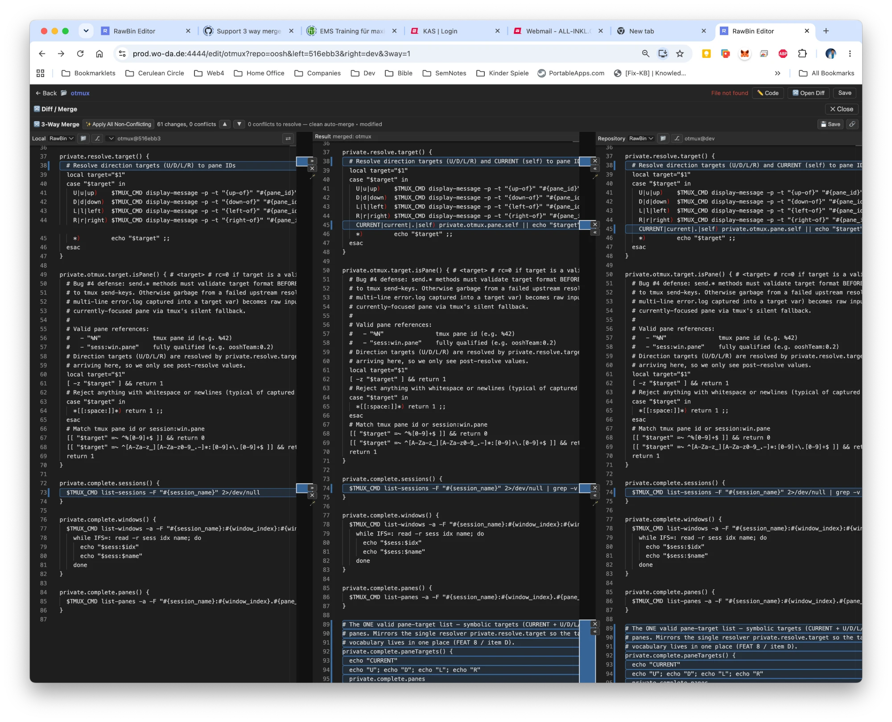

# R30.32 — Continuous Spline Ribbons Across 3 Editors (Tron REDESIGN)

**Tron directive (verbatim):** *"use SPLINES instead of boxes. clear CONTINUOUS mapping. ONE spline ACROSS 3 editors."*
The quality gap is DRAMATIC. v0.7.46 (box-outlines) is **NOT** acceptance. Match the target below.

## 🎯 TARGET — JetBrains Rider "Merge Revisions" (this is the bar)

What makes it good — replicate ALL of it:
- **One continuous filled ribbon per change**, flowing `Local → Result → Server` as a SINGLE shape. No rectangles.
- The ribbon **curves smoothly through each gutter** (cubic-bezier), connecting line-ranges that sit at **different Y** in each pane (e.g. Local L20-24 curves into Result L20-26). The curve absorbs the vertical offset.
- **Color-coded by kind:** blue = change, red/pink = conflict, green = the active/acceptable hunk. Filled translucent, but opaque enough to read on the dark gutter.
- Inline accept controls (`×` reject / `»` accept-toward-result / `«`) sit ON the ribbon edge but do **not** occlude it.
- At a glance you can trace ANY change from left pane through the merged result to the right pane. That legibility IS the requirement.

## ❌ CURRENT — RawBin v0.7.46 (what Tron rejected)

Why it fails:
- Changes are thin **blue box-outlines** per pane — isolated rectangles, no fill, no flow.
- The three panes are **visually disconnected**; only tiny `»`/`×` stubs sit at the gutter edge with nothing continuous between them.
- Impossible to trace a change across the panes. It shows *presence*, not *mapping*.

## Design task (architect → expert)
1. **Geometry:** for each change region compute its top/bottom Y in all three panes (Local, Result, Repository). Emit **ONE SVG `<path>`** per change: enter at Local's range → cubic-bezier across the **left gutter** into Result's range → bezier across the **right gutter** into Repository's range → close as a single filled ribbon. Control points ≈ horizontal tangents at each gutter edge (Rider-style S-curve).
2. **Replace** the box-outline / per-pane band renderers (`renderConnectorRibbons` + box outlines) with this single-ribbon renderer. Delete the boxes.
3. **Color + opacity** per kind (change/conflict/active), readable on `~#111` gutter.
4. Client-facing → **version-bump + atomic** (R30.28).
5. **GATE = screenshot + pixel** vs THIS target image (see [[visual-features-gate-by-pixel]]) — never element-count. A 3rd false-green is unacceptable.
