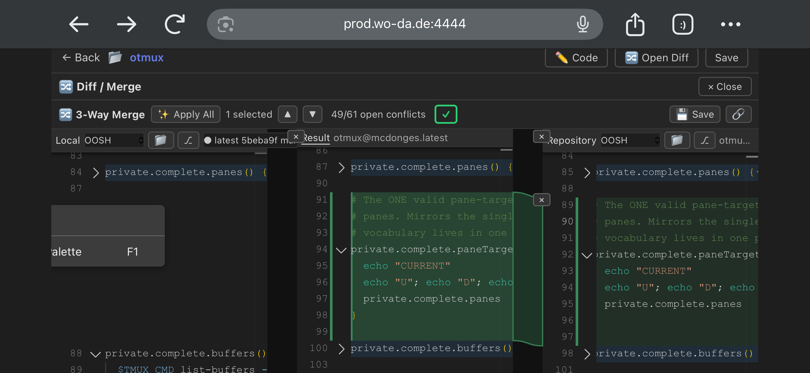
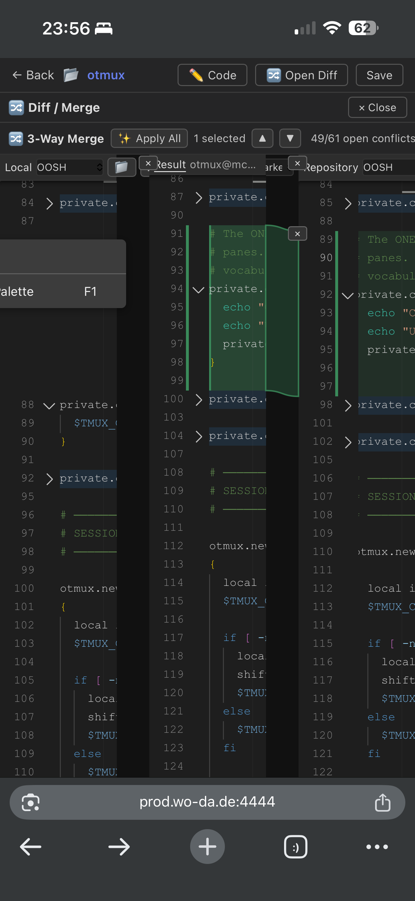

# R30.53 BUG (Tron device QA, mobile Safari prod.wo-da.de:4444) — left-pane fold desync → misalignment after a green block

Tron: *"not bad, but review what's going on after the green block with alignment and collapsing… it seems to break here. left is not collapsed and then misalignment starts."*

## Evidence

## Precise defect (measured from the screenshots)
- 3-pane merge (Local / Result / Repository), otmux file.
- There is a **GREEN added block** (the `# The ONE valid pane-target…` comment + `private.complete.paneTargets()` function) present in **Result (center L91-99)** and **Repository (right L89-97)** but **absent in Local** (it's an addition).
- **AFTER that green block, the collapse of an UNCHANGED method does NOT sync to the LEFT pane:**
  - **Local** line 88 = `⌄ private.complete.…` **EXPANDED** (chevron-down, shows body `$TMUX_…`, `}`).
  - **Result** line 100 = `› private.complete.…` **COLLAPSED**.
  - **Repository** line 98 = `› private.complete.…` **COLLAPSED**.
- Same unchanged method → collapsed in center+right, expanded in left. Left pane is therefore taller at that point → **every row below drifts out of 3-pane alignment.**

## What's violated
R30.53 AC "collapse UNCHANGED method-blocks **synced ×3**" fails for the **LEFT (Local)** pane, specifically **downstream of an add/green block**. The iPhone-12 LOGIC gate (GREEN DET-3x) missed it — it never asserted left-pane fold-state parity AFTER an addition, nor the resulting row-alignment.

## Scenario-first (NO hotfix — Tron directive)
1. **Architect** — diagnose ROOT CAUSE: why Local's fold state diverges from center/right after an add-block. Hypotheses to confirm by measurement: (a) `syncNativeFold` mirrors center↔repo but not Local; (b) the added block shifts Local's method-boundary line-mapping so `foldByMethodBoundaries` computes the wrong region for Local; (c) Local's fold decorations aren't recomputed after the add offset. Report diagnosis + fix direction.
2. **Req** — sharpen the AC / add the missing test-scenario: "collapse-unchanged sync ×3 MUST hold for the LEFT pane THROUGH and AFTER add(green) blocks; downstream row-alignment preserved." (Gate-coverage gap = the miss.)
3. **Expert** — fix per architect diagnosis (HOLD until it lands). Version-bump + atomic.
4. **Tester** — add a gate case reproducing THIS exact scenario (unchanged method after a green add-block → left/center/repo fold parity + 0px downstream row-drift), gated at Tron's real mobile viewport, not just logic at iPhone-12.
5. **Tron** — re-confirm on device.
